# FractionalDAO: เปลี่ยนโลกการลงทุนสินทรัพย์จริงด้วย Blockchain 🚀


[▶️ **ทดลองใช้งาน FractionalDAO (คลิกที่นี่)**](https://phattarapong26.github.io/FractionalDAO/#/)

FractionalDAO คือแพลตฟอร์มที่ช่วยให้ทุกคนสามารถร่วมลงทุนในสินทรัพย์จริง (Real World Asset) ได้อย่างโปร่งใส ปลอดภัย และไร้พรมแดน ด้วยพลังของ Blockchain และ Smart Contract

---

## ✨ ทำไมต้อง FractionalDAO?
- **ลงทุนสินทรัพย์จริงแบบ Fractional**: ไม่ต้องใช้เงินก้อนใหญ่ ทุกคนสามารถเป็นเจ้าของร่วมในสินทรัพย์ที่มีมูลค่าสูงได้
- **โปร่งใส ตรวจสอบได้**: ข้อมูลทุกอย่างบันทึกบน Blockchain ตรวจสอบย้อนหลังได้ 100%
- **ระบบ Governance กระจายอำนาจ**: นักลงทุนมีสิทธิ์โหวตและตัดสินใจร่วมกัน
- **ตลาดซื้อขายทันสมัย**: ซื้อ-ขายสิทธิ์การลงทุนได้อย่างอิสระตลอดเวลา
- **เหมาะทั้งนักลงทุนมือใหม่และมืออาชีพ**

---

## 👩‍💼 สำหรับนักลงทุน
- กระจายความเสี่ยงด้วยการลงทุนในสินทรัพย์หลากหลายประเภท
- ได้รับผลตอบแทนตามสัดส่วนการถือครอง
- มีส่วนร่วมในการบริหารสินทรัพย์ผ่านระบบ DAO

---

## 📖 เกี่ยวกับโปรเจค

FractionalDAO เป็นเว็บแอปพลิเคชันที่พัฒนาด้วย React, TypeScript และ Vite เชื่อมต่อกับ Smart Contract บน Blockchain เพื่อสร้างระบบการลงทุนแบบกระจายศูนย์ ใช้ UI ทันสมัยด้วย Shadcn/UI และ Tailwind CSS

## 🛠️ เทคโนโลยีที่ใช้

- **Frontend**: React, TypeScript, Vite
- **UI Components**: Shadcn/UI, Tailwind CSS
- **Blockchain**: Ethers.js
- **Smart Contract**: Solidity
- **Routing**: React Router DOM
- **Form Management**: React Hook Form, Zod

## 🚀 การติดตั้ง

```bash
# โคลนโปรเจค
git clone https://github.com/yourusername/SmartContractMD.git
cd SmartContractMD

# ติดตั้ง Dependencies
npm install

# รันในโหมดพัฒนา
npm run dev
```

## 📁 โครงสร้างโปรเจค

```
SmartContractMD/
├── src/                  # โค้ดหลักของแอปพลิเคชัน
│   ├── components/       # React Components ที่ใช้ร่วมกัน
│   ├── contexts/         # React Contexts
│   ├── hooks/            # Custom React Hooks
│   ├── lib/              # ฟังก์ชันและ Utilities
│   ├── pages/            # หน้าต่างๆ ของแอป
│   ├── types/            # TypeScript Types
│   ├── App.tsx           # Component หลัก
│   └── main.tsx          # Entry point
├── smartContract/        # Smart Contract เขียนด้วย Solidity
│   └── smartContract.sol # ไฟล์ Smart Contract
├── public/               # Assets สาธารณะ
├── docs/                 # เอกสารประกอบโปรเจค
│   ├── SMART_CONTRACT.md # เอกสารอธิบาย Smart Contract
│   ├── USER_GUIDE.md     # คู่มือการใช้งานสำหรับผู้ใช้ทั่วไป
│   └── DEVELOPER.md      # เอกสารสำหรับนักพัฒนา
└── ...                   # ไฟล์การกำหนดค่าต่างๆ
```

## 🔧 การใช้งาน

1. เชื่อมต่อกับ Wallet (Metamask หรือ wallet อื่นๆ ที่รองรับ)
2. ดำเนินการโต้ตอบกับ Smart Contract ผ่านอินเตอร์เฟซที่ใช้งานง่าย
3. ดูข้อมูลและธุรกรรมที่บันทึกบน Blockchain

ดูรายละเอียดเพิ่มเติมได้ที่ [คู่มือการใช้งาน](docs/USER_GUIDE.md)

---

## 🖼️ Screenshots Gallery

ตัวอย่างหน้าจอการใช้งาน FractionalDAO:

<table>
  <tr>
    <td align="center">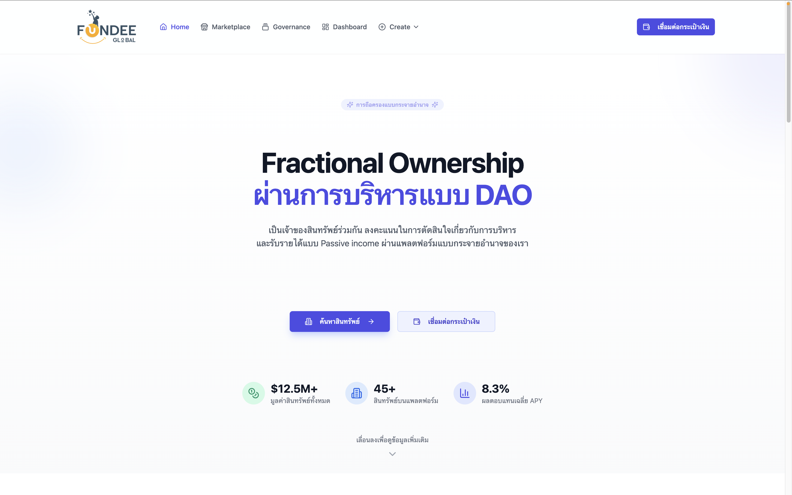<br/>หน้าแรกของแพลตฟอร์ม</td>
    <td align="center">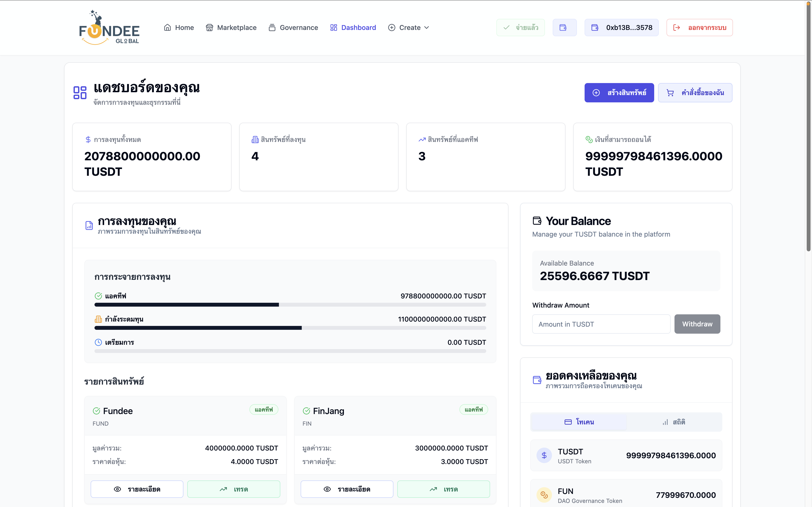<br/>แดชบอร์ดภาพรวมการลงทุน</td>
  </tr>
  <tr>
    <td align="center"><br/>ตลาดซื้อขายสิทธิ์การลงทุน</td>
    <td align="center">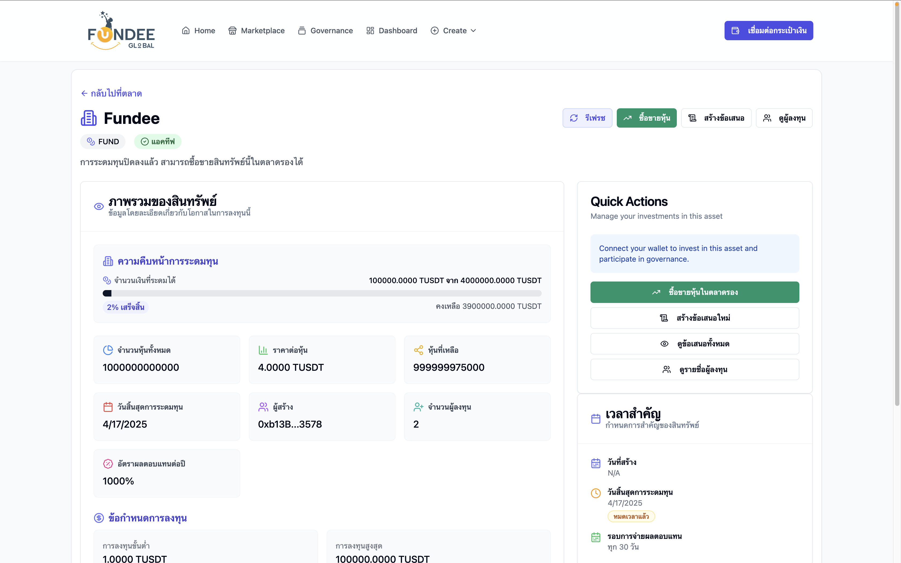<br/>ข้อมูลรายละเอียดสินทรัพย์</td>
  </tr>
  <tr>
    <td align="center">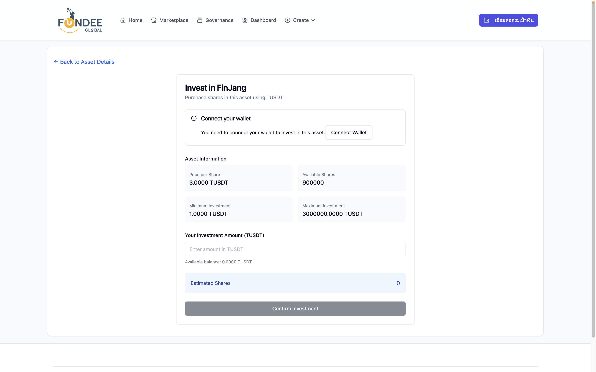<br/>หน้าลงทุนในสินทรัพย์</td>
    <td align="center">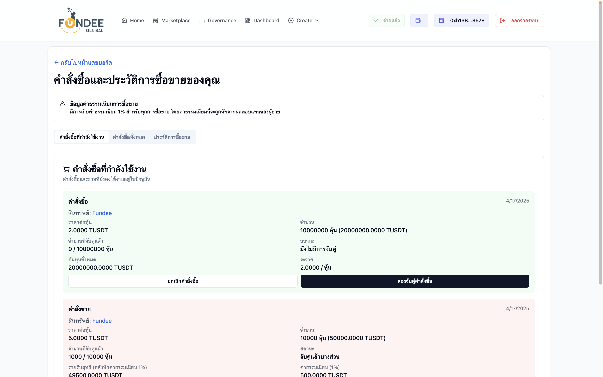<br/>ประวัติคำสั่งซื้อขาย</td>
  </tr>
  <tr>
    <td align="center">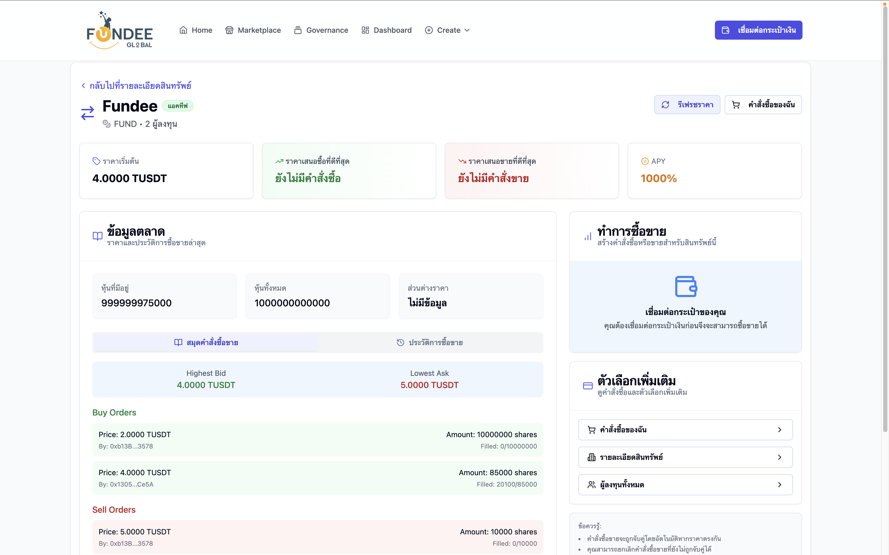<br/>หน้าซื้อขาย</td>
    <td align="center">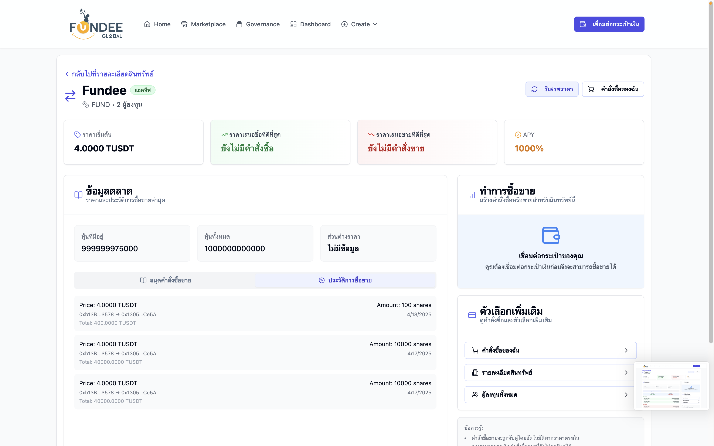<br/>ประวัติการซื้อขาย</td>
  </tr>
  <tr>
    <td align="center">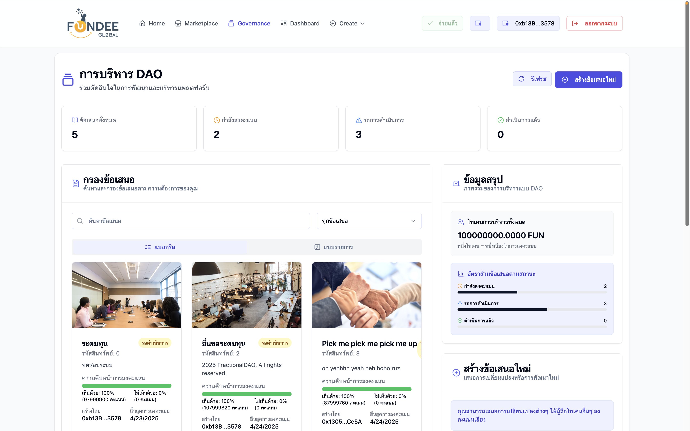<br/>ระบบโหวต Governance</td>
    <td align="center">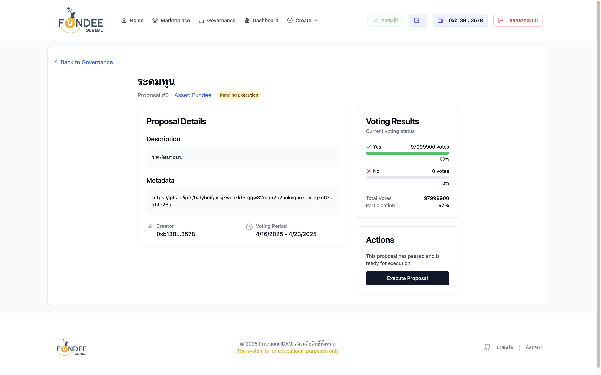<br/>ตัวอย่างหน้าการโหวต</td>
  </tr>
  <tr>
    <td align="center">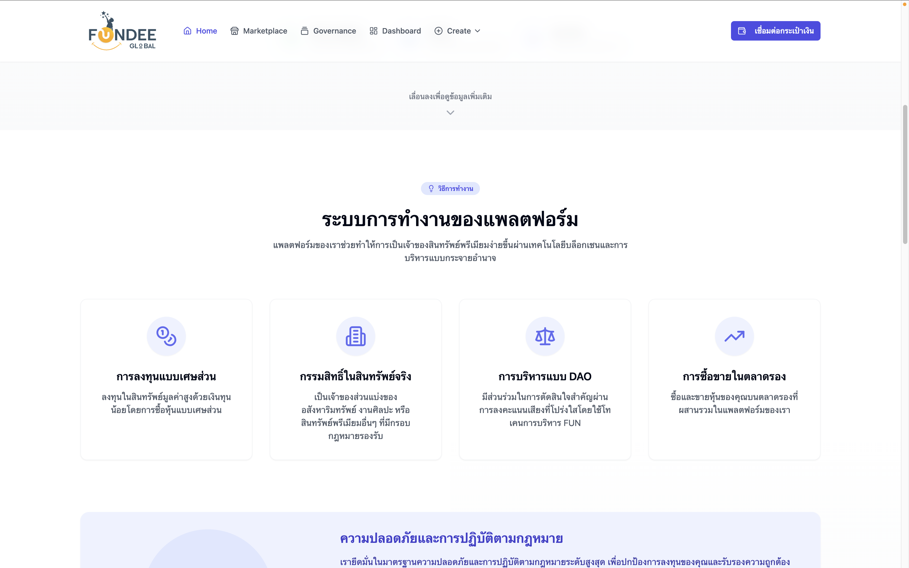<br/>ขั้นตอนการลงทุน</td>
    <td align="center">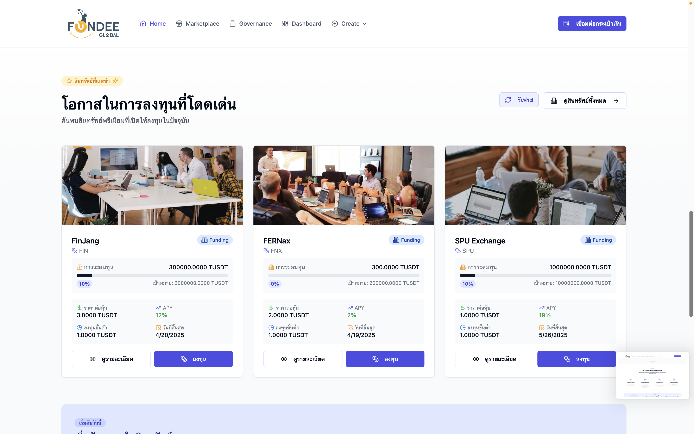<br/>พรีวิวสินทรัพย์</td>
  </tr>
  <tr>
    <td align="center"><br/>ทีมผู้ก่อตั้ง</td>
  </tr>
</table>

---

## 📝 วิธีมีส่วนร่วมในการพัฒนา

การมีส่วนร่วมในโปรเจคนี้ยินดีต้อนรับเสมอ! เรียนรู้เพิ่มเติมได้ที่ [CONTRIBUTING.md](CONTRIBUTING.md)

## 📄 เอกสารเพิ่มเติม

- [รายละเอียด Smart Contract](docs/SMART_CONTRACT.md) - เอกสารอธิบายการทำงานของ Smart Contract
- [คู่มือการใช้งาน](docs/USER_GUIDE.md) - สำหรับผู้ใช้งานทั่วไป
- [เอกสารสำหรับนักพัฒนา](docs/DEVELOPER.md) - รายละเอียดสำหรับนักพัฒนา

## 📄 ลิขสิทธิ์

โปรเจคนี้เผยแพร่ภายใต้ลิขสิทธิ์ MIT - ดูไฟล์ [LICENSE.md](LICENSE.md) สำหรับรายละเอียด

## 📞 ติดต่อ

หากคุณมีคำถามหรือข้อเสนอแนะ กรุณาเปิด Issue ใน GitHub Repository นี้ หรือติดต่อเราที่ [อีเมล](mailto:phattarapong.phe@spumail.net)

---

พัฒนาด้วย ❤️ โดยทีม Fundee FractionalDAO 

Computer Science | SPU
####เพื่อการศึกษาเท่านั้น!!!!
